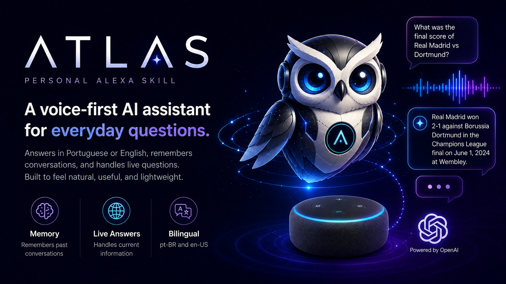

# Atlas

Personal Alexa skill that answers any question using the OpenAI API. No local server, runs entirely on AWS Lambda, designed to cost less than $5/month.

```text
Echo / Alexa app  ->  Custom Skill  ->  AWS Lambda (Node.js)  ->  OpenAI API
```

## Features

- Answers in Portuguese (pt-BR) or English (en-US), following the device locale
- Web search for current events and live data
- Cross-session memory: remembers the conversation even after the session ends (say "esquece tudo" / "forget everything" to wipe it)
- Distinct voice (Amazon Polly) so Atlas does not sound like the default Alexa
- Short, spoken-friendly answers with no markdown, URLs or citations

## Stack

| Piece | Choice |
|---|---|
| Runtime | AWS Lambda, Node.js 22 |
| Language | TypeScript, bundled with esbuild |
| Skill SDK | ask-sdk-core |
| Model | gpt-5-nano (OpenAI Responses API) |
| Memory | DynamoDB, one item per user |

## Prerequisites

- Node.js 22 (see `.nvmrc`)
- An AWS account
- An [Amazon developer account](https://developer.amazon.com) (same email as your Alexa devices)
- An OpenAI API key with a monthly usage limit set

## Setup

### 1. Local

```bash
npm install
cp .env.example .env   # then fill in the values
```

| Variable | Purpose |
|---|---|
| `OPENAI_API_KEY` | OpenAI API key |
| `ALEXA_SKILL_ID` | Locks the Lambda to your skill (you get it in step 3) |
| `OWNER_NAME` | Your name, used in the system prompt |
| `MEMORY_TABLE` | DynamoDB table name |
| `BUDGET_ALERT_EMAIL` | Email for AWS budget alerts |

Optional: `OPENAI_MODEL` and `OPENAI_TIMEOUT_MS` override the defaults.

### 2. AWS

Create an IAM user for deployment and attach `infra/deployer-policy.json` as its policy. Configure the AWS CLI with its access key.

Then, in `eu-west-1` (or your region):

```bash
# DynamoDB table for memory
aws dynamodb create-table \
  --table-name atlas-memory \
  --attribute-definitions AttributeName=id,AttributeType=S \
  --key-schema AttributeName=id,KeyType=HASH \
  --billing-mode PAY_PER_REQUEST

# Lambda execution role
aws iam create-role --role-name atlas-lambda-role \
  --assume-role-policy-document file://infra/lambda-trust-policy.json
aws iam attach-role-policy --role-name atlas-lambda-role \
  --policy-arn arn:aws:iam::aws:policy/service-role/AWSLambdaBasicExecutionRole
aws iam put-role-policy --role-name atlas-lambda-role \
  --policy-name atlas-memory --policy-document file://infra/lambda-memory-policy.json

# Build and create the function
npm run build && (cd dist && zip -q function.zip index.js)
aws lambda create-function \
  --function-name atlas \
  --runtime nodejs22.x \
  --handler index.handler \
  --timeout 10 --memory-size 256 \
  --role arn:aws:iam::<ACCOUNT_ID>:role/atlas-lambda-role \
  --zip-file fileb://dist/function.zip \
  --environment "Variables={OPENAI_API_KEY=...,ALEXA_SKILL_ID=...,MEMORY_TABLE=atlas-memory,OWNER_NAME=...}"

# Short log retention keeps costs near zero
aws logs put-retention-policy --log-group-name /aws/lambda/atlas --retention-in-days 3
```

Cost control (recommended): create a $5 budget with `infra/budget.json` and `infra/budget-notifications.json` after replacing `${BUDGET_ALERT_EMAIL}` with your email:

```bash
aws budgets create-budget --account-id <ACCOUNT_ID> \
  --budget file://infra/budget.json \
  --notifications-with-subscribers file://infra/budget-notifications.json
```

### 3. Alexa skill

1. Go to the [Alexa developer console](https://developer.amazon.com/alexa/console/ask) and create a skill: type **Custom**, hosting **Provision your own**
2. In **Build > Interaction Model > JSON Editor**, paste `skill-package/interactionModels/custom/pt-BR.json` for the pt-BR locale and `en-US.json` for en-US, then **Build Model**
3. Copy the skill ID from **Endpoint** and put it in your `.env` and in the Lambda environment (`ALEXA_SKILL_ID`)
4. Set the endpoint's **Default Region** to the Lambda ARN
5. Allow the skill to invoke the Lambda:

```bash
aws lambda add-permission \
  --function-name atlas \
  --statement-id alexa-skill \
  --action lambda:InvokeFunction \
  --principal alexa-appkit.amazon.com \
  --event-source-token <SKILL_ID>
```

6. Test in **Test** tab (enable "Development") or on any Echo linked to your account

## Usage

```text
Alexa, ask atlas why the sky is blue        (one-shot, session closes)
Alexa, open atlas                            (conversation mode, mic stays open)
Alexa, pergunte ao atlas o que é uma lambda
```

## Development

```bash
npm run typecheck   # type checking, no emit
npm run build       # bundle to dist/index.js
npm run ask -- "your question here"   # test the OpenAI flow locally
```

Deploy after a change:

```bash
npm run build && (cd dist && zip -q function.zip index.js)
aws lambda update-function-code --function-name atlas --zip-file fileb://dist/function.zip
```

## Project layout

```text
src/
  index.ts                 skill handlers and request routing
  services/
    openaiClient.ts        OpenAI Responses API call, error detection
    memory.ts              DynamoDB persistence of the conversation id
    messages.ts            everything Atlas says, per locale
    speech.ts              SSML voice wrapping and output sanitizing
scripts/                   local test scripts
skill-package/             Alexa interaction models (pt-BR, en-US)
infra/                     IAM policies and budget templates
```

## Cost profile

- Lambda and DynamoDB stay inside the AWS free tier at personal usage
- gpt-5-nano with capped output tokens keeps OpenAI costs at a few cents per hundred questions
- CloudWatch logs expire after 3 days
- The AWS budget alerts at 50%, 80% and forecasted 100% of $5
